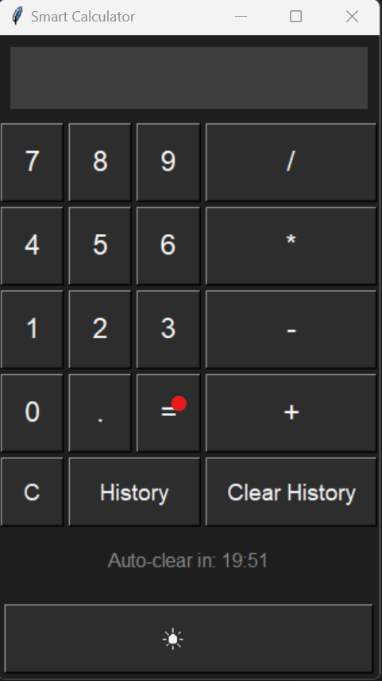

# 🧮 Smart Calculator

A sleek, interactive calculator built with Python and Tkinter — complete with dark/light mode toggle, history logging, auto-clear functionality, and a smooth user interface.

## 🚀 Features

- ✅ Clean GUI using Tkinter
- 🌙 Dark mode / ☀️ Light mode toggle
- 🧠 History logging of all calculations (`history.txt`)
- ⏳ Auto-clear history every 20 minutes
- 🖱️ On-screen number buttons
- 🔒 Single history tab at a time (no clutter!)
- 💾 Designed with usability in mind — responsive and simple

## 📸 Preview



_(Add your own screenshot or screen recording here!)_

## 📁 How to Run

1. Make sure Python is installed (version 3.6+ recommended).
2. Download or clone the repo:
   ```bash
   git clone https://github.com/yourusername/smart-calculator.git
